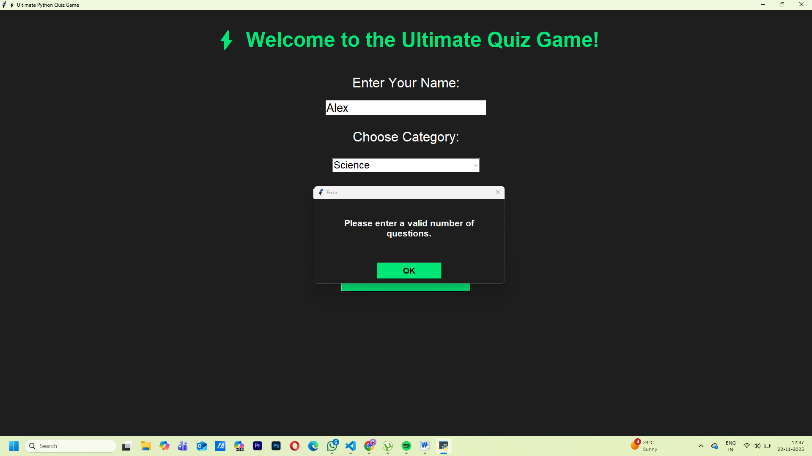
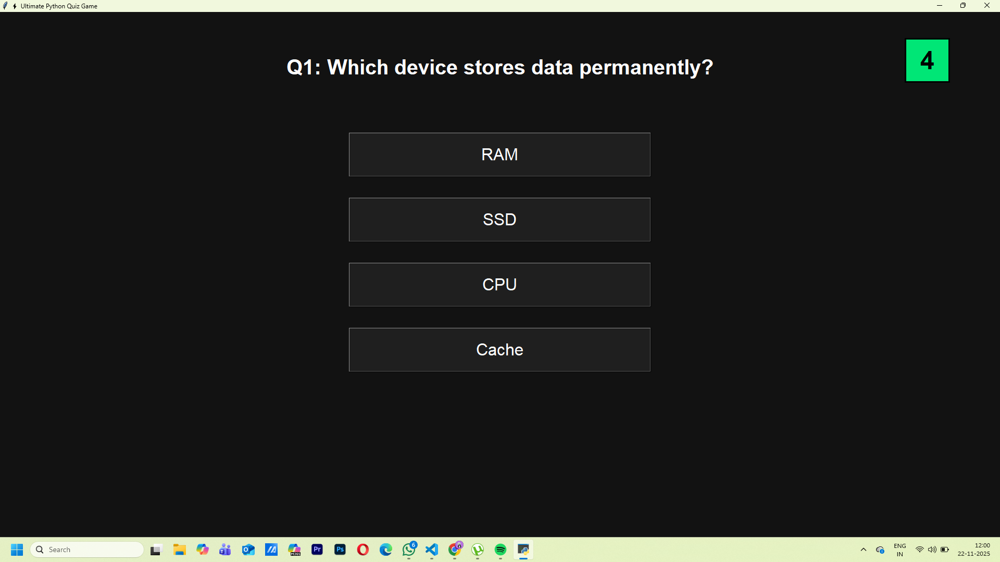
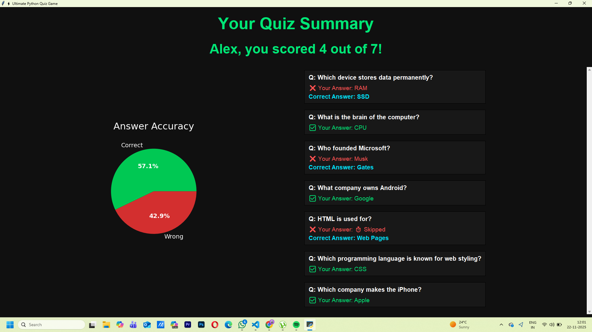
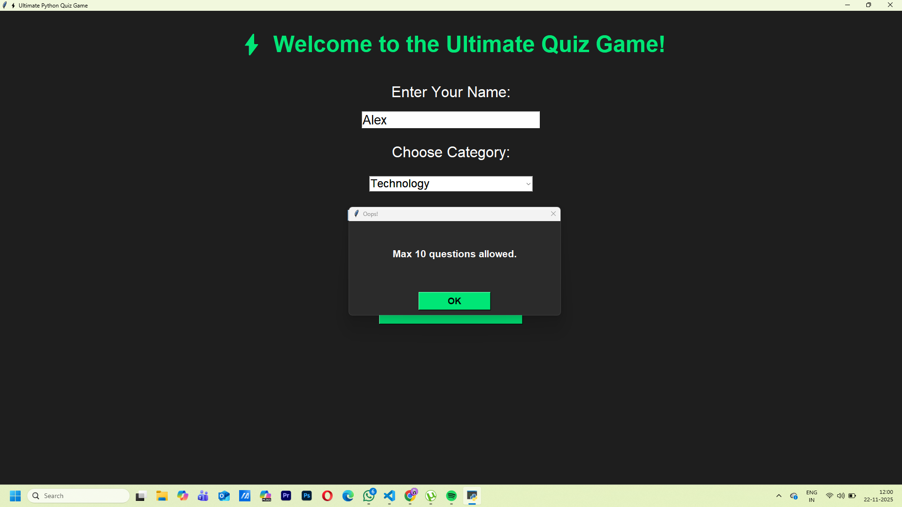

# Quizz-App
# 🎯 A Python Quiz Game

A desktop-based Quiz Game developed using Python and Tkinter. The application allows users to enter their name, select a quiz category, attempt timed questions, and view their score along with a graphical performance summary.

---

## 📌 Features

* User name input and validation
* Multiple quiz categories
* Random question selection
* Adjustable number of questions (up to 10)
* 5-second countdown timer for each question
* Automatic skip on timeout
* Score calculation
* Performance visualization using Pie Chart
* Scrollable answer review section
* Custom error dialog boxes
* Modern and attractive GUI

---

## 🛠 Technologies Used

* Python
* Tkinter
* Matplotlib
* Seaborn
* Random Module

---

## 📂 Quiz Categories

* General Knowledge
* Science
* Technology
* Mathematics
* Sports
* History

---

## 🚀 Installation & Execution

### Clone Repository

```bash
git clone https://github.com/Rupashi-Maurya-05/Quizz-App.git
```

### Navigate to Project Folder

```bash
cd Quizz-App
```

### Install Required Libraries

```bash
pip install matplotlib seaborn
```

### Run Application

```bash
python QuizApp.py
```

---

## 📸 Screenshots

### Home Page



### Quiz Page



### Result Page



### Validation Dialog Boxes



---

## 🧠 Python Concepts Demonstrated

### Object-Oriented Programming (OOP)

* Multiple classes used:

  * QuizApp
  * HomePage
  * QuizPage
  * ResultsPage

### Data Structures

* Dictionary for storing quiz questions
* Lists for selected questions and user responses

### Exception Handling

* Validates number of questions entered by user
* Prevents crashes caused by invalid input

### Random Module

* Randomly selects quiz questions using `random.sample()`

### GUI Programming

* Built completely using Tkinter
* Uses Labels, Buttons, Entry Widgets, Comboboxes, Frames, and Custom Dialogs

### Data Visualization

* Pie Chart showing Correct vs Wrong Answers using Matplotlib

---

## 📊 Application Workflow

1. Enter player name.
2. Select quiz category.
3. Enter number of questions.
4. Start the quiz.
5. Answer questions within the timer limit.
6. View final score.
7. Analyze performance through pie chart.
8. Review all answers in the summary section.

---

## 🔮 Future Enhancements

* Difficulty Levels
* User Login System
* Database Integration
* Leaderboard Feature
* Additional Quiz Categories
* Question Import from Files

---

## 👩‍💻 Developer

**Rupashi Maurya**

GitHub: https://github.com/Rupashi-Maurya-05

---

⭐ If you found this project useful, consider giving it a star on GitHub.
